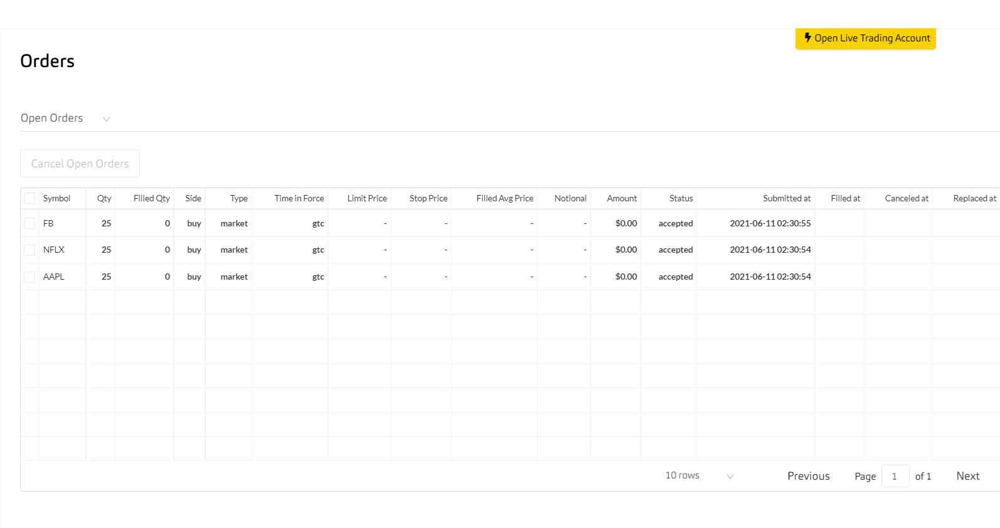
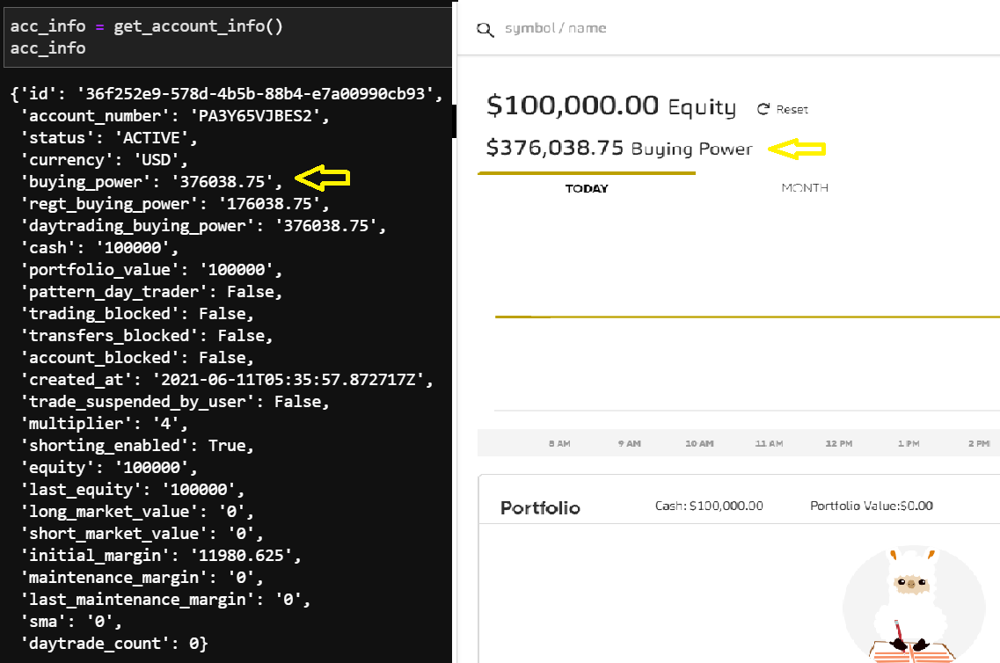

# Alpaca Paper Trading 
## Overview
In this notebook, we will use `Python` and the `requests` library to test different endpoints of the `alpaca api`. Keep in mind that software development kits are available for Alpaca, the purpose of this notebook is to practice making raw api calls to have a better understanding of how they work. Please refer to the official [documentation](https://alpaca.markets/docs/api-documentation/) for further support.

### Tools 
* Jupyer lab
* Postman
* Alpaca Paper Trading Account
* Python

### Create A Free Alpaca Account
Download and store your api keys in a `.env` file. Alpaca will give you $100,000 in equity and $400,000 in buying power to begin experimenting with live trades. 


### Develop Functions to Interact With Alpaca

#### Placing Orders
```python 
# create list 
symbols = ['AAPL', 'NFLX', 'FB']
# loop through list to place orders
for i in symbols:
    # call create order function
    response = create_order(i, 25, 'buy', 'market', 'gtc')
```
After the running the `for loop`, we can go to our alpaca dashboard to confirm our orders went through.




We can also use the api to fetch the latest account information.



